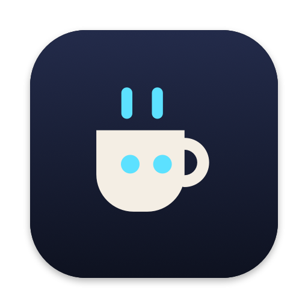

<p align="center"></p>

<h1 align="center">Agent Mode</h1>

<p align="center">A macOS menu bar app that keeps your Mac awake while AI coding agents are working, then lets it sleep when they're done.</p>

---

Leave Claude Code, Codex or another agent on a long task and walk away. Agent Mode keeps the Mac awake while the agent is actually working and sends you a notification when it finishes. It doesn't keep the Mac awake for agent sessions that are sitting idle.

The robot mug in your menu bar shows the state. Steam and open eyes mean the Mac is staying awake; the steam moves while agents work, and the time next to the mug shows how long they've been at it. Closed eyes mean the Mac is allowed to sleep.

## Features

- **Knows when agents are working.** With hooks set up, Claude Code tells Agent Mode exactly when it starts and stops. Other agents count as working while they use CPU or receive a reply from their model.
- **Notifications** when an agent finishes ("claude finished in my-app: worked for 47m") or stops to ask for your input.
- **Battery safety.** Lets the Mac sleep once the battery drops to a level you choose (20% by default).
- **Closed-lid mode (optional).** Keeps the Mac awake with the lid closed, but only while agents are working. It turns off automatically when the Mac gets hot or the battery runs low.
- **Sleep when done.** Choose *Sleep When All Agents Finish* before an overnight run, or *Sleep When This Finishes* on a single session. The Mac sleeps 2 minutes after the work ends, and you can cancel from the menu.
- **Today's total** in the menu: "Today: agents worked 5h 12m".
- **Manual control.** Keep the Mac awake until you turn it off, or for 30 minutes up to 8 hours.
- **Settings window** for the agent list, notifications, battery limit, keeping the display on and launch at login.
- **Update check.** The menu tells you when a new release is out.
- **Phone companion (Agent Mode Pro, coming soon).** When Pro is set up on a Mac, the menu adds *Open Tasks…* and *Pair Phone…*, keeps the phone link running, and `agentmode claude` starts Claude Code so your phone can follow and drive it. Without Pro, none of this appears.

Agent Mode uses the same macOS power assertion as the built-in `caffeinate` command. The only network request it makes is the daily update check, which you can turn off in Settings.

## Install

Requires macOS 13 or later. Works on Apple Silicon and Intel Macs.

### Homebrew

```sh
brew install --cask ovedaydin/tap/agent-mode
```

Homebrew also adds an `agentmode` command for the [hooks CLI](#other-agents).

### Download

Get **Agent-Mode.dmg** from the [latest release](https://github.com/ovedaydin/agent-mode/releases/latest), open it and drag **Agent Mode** into Applications. `Agent-Mode.zip` in the same release has the same app.

The app isn't notarized by Apple, so macOS blocks it the first time you open it. To allow it, open **System Settings → Privacy & Security**, scroll down and click **Open Anyway**. Or run:

```sh
xattr -dr com.apple.quarantine "/Applications/Agent Mode.app"
```

### Build from source

You need the Xcode Command Line Tools (`xcode-select --install`).

```sh
git clone https://github.com/ovedaydin/agent-mode.git
cd agent-mode
./build.sh --install   # builds, copies to /Applications and launches it
```

## Set up your agents

### Claude Code (recommended)

Choose **Set Up Claude Code Hooks…** in the menu. Agent Mode adds a few hooks to `~/.claude/settings.json` and saves a backup next to it. New Claude Code sessions use them. You can remove them in **Settings**.

Without hooks, Agent Mode has to guess from CPU use and network traffic. That works well, but hooks are exact, and they make the "needs you" notification possible.

You can also set the hooks up from the terminal:

```sh
"/Applications/Agent Mode.app/Contents/MacOS/AgentMode" install-claude-hooks
```

### Codex

Codex can run one program at the end of each turn. In **Settings**, click **Copy Config Line** and paste the line into `~/.codex/config.toml`. This replaces any `notify` line you already have.

### Other agents

Processes named `claude`, `codex`, `aider`, `gemini`, `cursor-agent`, `opencode`, `amp` and `goose` count as working while they use CPU or receive data from their model. Edit the list in **Settings**.

Any script can also report its state directly:

```sh
AGENTMODE="/Applications/Agent Mode.app/Contents/MacOS/AgentMode"
"$AGENTMODE" hook busy --agent my-agent    # starts keeping the Mac awake
"$AGENTMODE" hook idle --agent my-agent    # stops, and notifies you if the task ran long enough
```

## Closed-lid mode

Normally, closing the lid puts a Mac to sleep no matter what. Turning on **Stay awake with the lid closed** in Settings changes that while agents are working.

It uses `pmset disablesleep`, which needs administrator access. When you turn it on, macOS asks for your password once. Agent Mode then installs a rule in `/etc/sudoers.d/agentmode` that lets it run only `pmset -a disablesleep 1` and `pmset -a disablesleep 0`. Turning the option off in Settings doesn't remove the rule. To remove it, run `sudo rm /etc/sudoers.d/agentmode`.

Closed-lid mode turns off when agents finish, the battery reaches your limit, the Mac gets hot, or you quit the app. A closed Mac can still get warm, so don't put it in a bag while it's running.

## Troubleshooting

Check whether Agent Mode is keeping the Mac awake:

```sh
pmset -g assertions | grep "Agent Mode"
```

## Releasing

Push a version tag and GitHub Actions does the rest:

```sh
git tag v1.3 && git push origin v1.3
```

[The release workflow](.github/workflows/release.yml) builds the app, publishes `Agent-Mode.zip` and `Agent-Mode.dmg` to a GitHub release, and updates the cask in [ovedaydin/homebrew-tap](https://github.com/ovedaydin/homebrew-tap). It uses a deploy key stored as the `TAP_DEPLOY_KEY` secret. To write release notes yourself, create the release with `gh release create v1.3 --notes-file notes.md` instead of pushing the tag. The workflow then adds the files to it.

## License

[MIT](LICENSE)
